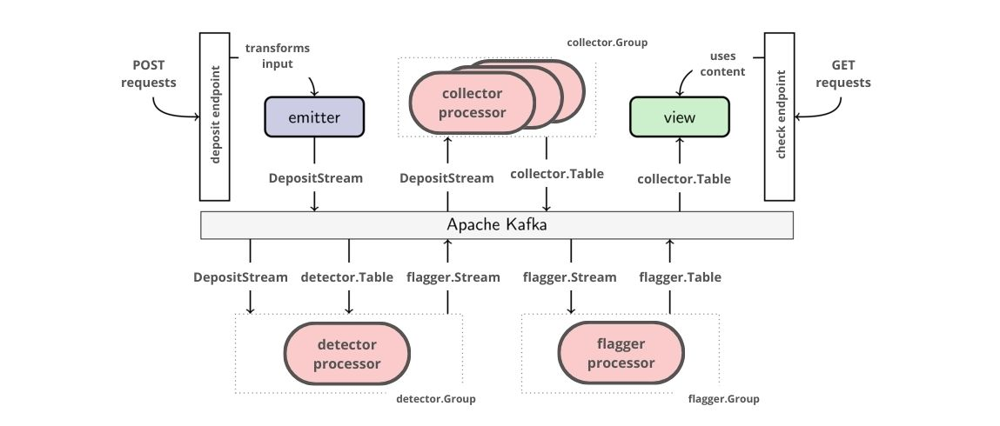

# Depositaja: Wallet deposit service using Event-driven architecture

In this project, I build a fictitious wallet deposit service. Our main goal is to explore implementation of event-driven architecture using Kafka as the message broker.
Several assumptions were made to pertain simplicity of the project, such as no authentication middleware, users cannot withdraw, and other out-of-topic features.

The service offers only two endpoints:

1. `localhost:8080/deposit` HTTP POST endpoint for user to deposit money. This endpoint takes JSON data containing the *wallet_id*, and the *amount* of the deposit and emits it to Kafka.
2. `localhost:8080/check/{wallet_id}` HTTP GET endpoint to get the balance of the wallet, also a flag whether the wallet has ever done one or more deposits with amounts more than 10,000 within a single 2-minute window (rolling-period). The *wallet_id* in the URLs refers to the wallet id.

In building this, we will follow the following architecture requirements:

1. Use [Goka](https://github.com/lovoo/goka), a stream processing library for [Apache Kafka](https://kafka.apache.org/) written in Go.
2. Use [protobuf](https://developers.google.com/protocol-buffers/docs/gotutorial) when encoding/decoding payload to/from Kafka broker.
3. Use Goka's Local storage mechanism.

To run the project, you can follow [this](https://github.com/dinorain/depositaja#running-the-project).

## Basic components and features

Goka provides three components to build systems: emitters, processors, and views.
The following figure depicts the design used in this project, using those three components together with Kafka and the endpoints.



### Deposit endpoint

The main message type we will be dealing with is the [`depositRequest`](service/service.go#L19) type:

```go
type depositRequest struct {
	WalletID string  `json:"wallet_id"`
	Amount   float64 `json:"amount"`
}
```

If Dustin wants to deposit an amount of money, he would send a request to the deposit endpoint with the wallet id and the amount of the money.
For example:

```sh
curl -X POST                                                   \
    -d '{"wallet_id": "0x1a3565a67721b6ab46fB11d5CF33A72D871aEbA3", "amount": "2000"}' \
    http://localhost:8080/deposit
```

The deposit handler parses request message type.
Afterwards, it emits the message into the `DepositStream` topic using the receiver *wallet_id* as key:

```go
func deposit(emitter *goka.Emitter, stream goka.Stream) func(w http.ResponseWriter, r *http.Request) {
	return func(w http.ResponseWriter, r *http.Request) {
		...
	}
}
```

We then configure the emitter to emit into the `DepositStream` topic by default and to use `DepositCodec` to encode the message.
This is how the emitter is [created](service/service.go#L55):
```go
emitter, err := goka.NewEmitter(brokers, stream, new(depositaja.DepositCodec))
router.HandleFunc("/deposit", send(emitter)).Methods("POST")
```

Note I am ignoring errors in this document for the sake of readability.
The complete example in the repository handles them, though.

### Collecting messages with `Context.Value()` and `Context.SetValue()`

Define the *balance table* to contain the deposit history stated in each wallet.
The *collector processor* keeps the table up-to-date by consuming `DepositStream`.
Define the collector callback as [follows](collector/collector.go#L17):

```go
// collect callback is called for every message from DepositStream.
// ctx allows access to collector table and msg is the input message.
func collect(ctx goka.Context, msg interface{}) {
	ml := &pb.DepositHistory{}
	if v := ctx.Value(); v != nil {
		ml = v.(*pb.DepositHistory)
	}

	m := msg.(*pb.Deposit)

	ml.WalletId = m.WalletId
	ml.Deposits = append(ml.Deposits, m)

	ctx.SetValue(ml)
}
```

The `ctx` is scoped with the key of the input message -- remember we used the receiver as key in the emitter.
With `ctx.Value()` we fetch the table value for that key.
In this processor, the value is a slice of messages.
We then append the received message and cap the length of the slice with the constant `maxMessages`, which is 5.
Finally, we store the value back in the table with `ctx.SetValue()`.


To create the processor, we need to define the group input stream and table's persistence:
```go
g := goka.DefineGroup(goka.Group("balance"),
	// the group table ("balance-table") persists deposit lists
	goka.Persist(new(depositaja.DepositListCodec)),
	// input stream is DepositStream with DepositListCodec and collect callback
	goka.Input(depositaja.DepositStream, new(depositaja.DepositCodec), collect),
)
p, _ := goka.NewProcessor(brokers, g)
```

### Check endpoint

When Dustin wants to check his wallet balance, he requests that from the check endpoint.
For example:
```
$ curl localhost:8080/0x1a3565a67721b6ab46fB11d5CF33A72D871aEbA3/feed
{
	"wallet_id": "0x1a3565a67721b6ab46fB11d5CF33A72D871aEbA3",
	"balance": 2000,
	"above_threshold": false
}
```

The handler employs a view on `collector.Table` to retrieve the messages for Dustin.
It gets the *wallet_id* from the URL and tries to get the value from the view.
If no value is available, the user has received no messages yet.
Otherwise, the handler loops over the messages, calculate the balance, check if the wallet deposit is above the threshold, and formats the output.

```go
func check(view *goka.View, flaggerView *goka.View) func(w http.ResponseWriter, r *http.Request) {
	return func(w http.ResponseWriter, r *http.Request) {
		...
	}
}
```

When creating the view, it is configured to watch the `collector.Table` and use `depositaja.DepositListCodec` to decode table values.

```go
view, _ := goka.NewView(
	brokers,
	collector.Table,
	new(depositaja.DepositListCodec),
)
router.HandleFunc("/check/{wallet_id}", feed(view)).Methods("GET")
```

`DepositListCodec` simply encodes and decodes the message of `DepositList` into and from protocol buffer data.

### Flagging wallets

We would need to flag wallets that have ever done one or more deposits with amounts more than 10,000 within a single 2-minute window (rolling-period).

For that, create a flagger processor, which keeps a table of wallets that have been flagged.
The flagger processor consumes from `flagger.Stream` and stores a `FlagValue` in the `flagger.Table`:

```go
func flag(ctx goka.Context, msg interface{}) {
	...
}
```

To add or remove a wallet manually from the flagger table, we can use the command line tool cmd/flag-wallet:

```sh
go run cmd/flag-wallet/main.go -wallet 0x1a3565a67721b6ab46fB11d5CF33A72D871aEbA3 # use -remove to remove the flag
```

### Automatic above-threshold detection

In this project, we give a flag if the wallet has ever done one or more deposits with amounts more than 10,000 within a single 2-minute window (rolling-period).
So, if we can detect wallets that fulfill that property, we can flag them.

We want to build a detector processor that counts total amount of deposits within a single 2-minute window (rolling-period) and issues a `FlagEvent` if the amount exceeds a threshold.
The detector table should keep the following value for each user.
```go
type Counter struct {
	state         protoimpl.MessageState
	sizeCache     protoimpl.SizeCache
	unknownFields protoimpl.UnknownFields

	RollingPeriodStartUnix int64   `protobuf:"varint,1,opt,name=rolling_period_start_unix,json=rollingPeriodStartUnix,proto3" json:"rolling_period_start_unix,omitempty"`
	Received               float64 `protobuf:"fixed64,2,opt,name=received,proto3" json:"received,omitempty"`
}
```

Whenever update happens in the table value, it should check whether the wallet gets a flag.
If the amount of deposit sent is more than `maxAmount` within a single 2-minute window (rolling-period), we add a flag the wallet and issue a `FlagEvent`.

```go
func detectSpammer(ctx goka.Context, c *pb.Counter) bool {
	return c.Received >= maxAmount && c.RollingPeriodStartUnix != 0
}
```

### Counting deposit amounts

Now, we defined an approach to detect if a wallet is above threshold, but we have to keep the values in the group table updated.
We define the group graph in parts.
Here is the callback for `DepositStream`:

```go
input := goka.Input(depositaja.DepositStream, new(depositaja.DepositCodec), func(ctx goka.Context, msg interface{}) {
	...
}
func getValue(ctx goka.Context) *pb.Counter {
	if v := ctx.Value(); v != nil {
		return v.(*pb.Counter)
	}
	return &pb.Counter{}
}
```

For every message received from `DepositStream`, we first get the value for the key or create a new `Counter` protocol buffer object.
`DepositStream` has the sender as key, so we add amount `c.Amount` and store back in the group table with `ctx.SetValue()`.
Next, we call `detectSpammer(ctx, c)`, which will check whether sent rate is higher than a threshold.

Next, we check whether the user is a spammer with the following function.

### Group graph
Finally, we define the complete group as follows:
```go
g := goka.DefineGroup(goka.Group("threshold"),
	input,
	goka.Output(flagger.Stream, new(flagger.FlagEventCodec)),
	goka.Persist(new(CounterCodec)),
)
p, _ := goka.NewProcessor(brokers, g)
```

### Recap

At this point, let's make a short recap. So far we have created:

- a [service](service/service.go) with deposit and check endpoints;
- a [collector processor](collector/collector.go) to collect deposit sent to wallet;
- a [flagger processor](flagger/flagger.go) to keep a table tracking flagged wallets;
- a [detector processor](detector/detector.go) to automatically flag wallets with deposits above threshold;
- a [flag-wallet tool](cmd/flag-wallet) to add/remove flags to/from wallets.

### Running the project

In this project, we can put the endpoint handlers and, consequently, emitter and view in the same Go program.
In another Go program, we start the collector processor. This will allows us to start, stop, and scale them independently.

Before starting any Go program, run `make start` to start Docker containers for ZooKeeper and Kafka.

Make sure you [create](https://docs.confluent.io/5.5.4/quickstart/cos-docker-quickstart.html#step-2-create-ak-topics) the required Kafka topics.

```sh
make dev # to start endpoint handlers, emitter and view
```

In another terminal, start the processor:

```sh
make processor # start collector processor, detector processor, and flagger processor
```

or 

```sh
go run cmd/processor/main.go -collector -flagger -detector
```

Internally the Go Program will start three Goka processors.
Alternatively, you can run the processors individually by starting the program multiple times with the respective flags.

After you started both Go programs, you can use `curl` to check Dustin's wallet:

```sh
curl localhost:8080/check/0x1a3565a67721b6ab46fB11d5CF33A72D871aEbA3
```

or open [http://localhost:8080/check/0x1a3565a67721b6ab46fB11d5CF33A72D871aEbA3](http://localhost:8080/check/0x1a3565a67721b6ab46fB11d5CF33A72D871aEbA3) in the browser.

You can deposit money to Dustin's wallet using `curl`, for example,

```sh
curl -X POST                                                   \
    -d '{"wallet_id": "0x1a3565a67721b6ab46fB11d5CF33A72D871aEbA3", "amount": "999999999"}' \
    http://localhost:8080/deposit
```